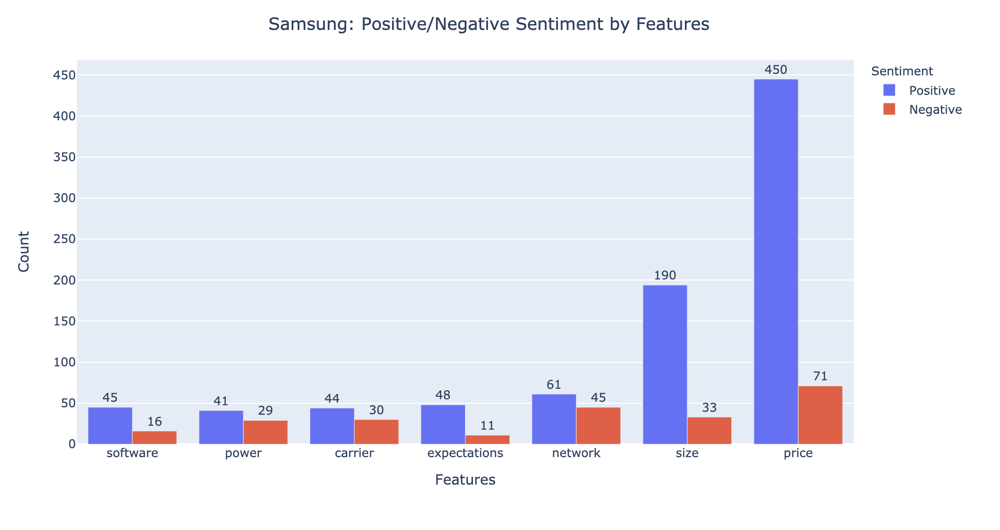
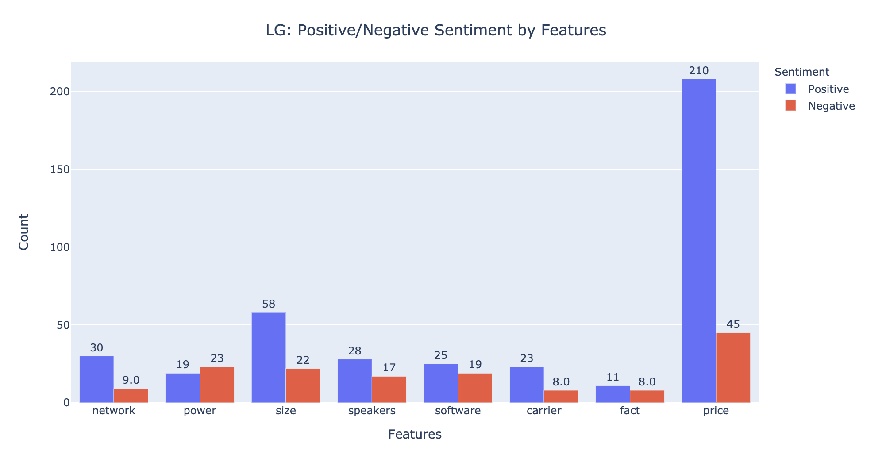

# Sentiment_Analysis_Project

[Full report](https://github.com/Derolik666/Sentiment_Analysis_Project/blob/master/Final_Report.pdf) and the [presentation slides](https://github.com/Derolik666/Sentiment_Analysis_Project/blob/master/Presentation.pdf) along with the [codes](Sentiment_Analysis_Project/Codes/) can be accessed here.

## Problem Statement

* Customer reviews not only help buyers to make better purchase decision but also enable companies to improve their products. 
* Companies need to find an automated way to understand customers' sentiments based on the customer reviews
* Companies would also like to utlize customer reviews to know what product features are good and what need improvement 

## Solutions

* A LSTM network to predict customers' attitudes based on the customer reviews
* An algorithm to extract product features and customers' opinions on those features

## Results
Here I included results of Samsung and LG for illustration purpose. Results for other brands can be accessed here 
[Feature_Extraction_Results](https://github.com/Derolik666/Sentiment_Analysis_Project/tree/master/Feature_Extraction_Results)
* Feature extraction results of Samsung products

* Feature extraction results of LG products

* Predictive Model Results

| Model        | Accuracy | Precision (Weighted) | Recall (Weighted) | F1 (Weighted) |
| -------------|----------| ---------------------|-------------------|---------------|
| Random Forest|  0.815   | 0.838                | 0.815             | 0.822         | 
| KNN          |  0.862   | 0.846                | 0.852             | 0.847         |
| Naive Bayes  |  0.674   | 0.628                | 0.674             | 0.610         |
| LSTM         | **0.877**|**0.895**             |**0.852**          |**0.874**      |
## Abstract
Customer reviews not only help buyers to make better purchase
decision but also enable companies to improve their products. In
this project, we plan to train a LSTM network on the Amazon
Reviews: Unlocked Mobile Phone from Kaggle data set to classify the
correct customer sentiment from given product reviews. Besides,
we plan to perform characteristic extraction on the given reviews
and summarize the customers’ opinions on those characteristics
and give business insights to the companies. The data set we used in
this project contains 413,840 data entries and six features including
product name, rating, brand name, price, reviews and review votes.
Through our analysis, we found out that customer satisfaction
toward the product is positively related to the product price and
negatively related to the length of the review. To be more specific,
more expensive phones tend to get higher ratings, and more
satisfied customers tend to leave shorter comments.
We trained three models as our baselines, which are Random
Forest, K-Nearest Neighbors (KNN), and Naive Bayes. Both
the Random Forest and KNN models produced good results, which
obtained weighted-F1 scores of 0.822 and 0.847 respectively. Naive
Bayes performed worse than the previous two models which obtain
an weighted-F1 score of 0.610.

